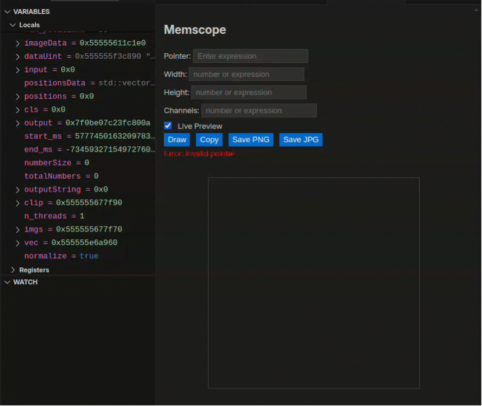

# MemScope

MemScope can preview image data loaded in memory during debugging.

## Features

_Preview images from memory in real-time during debugging_

**made by [mdhvg](https://github.com/mdhvg) 🐢**
