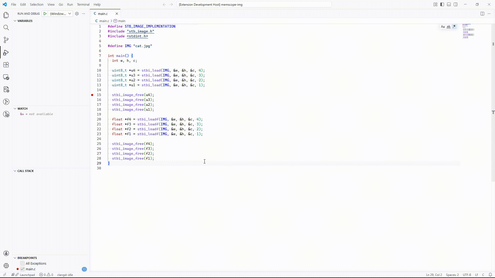

# MemScope

MemScope can preview image data loaded in memory during debugging.

## Features

_Preview images from memory in real-time during debugging_

## Usage

- Start debugging any project and pause when an image is loaded into memory.
- Press `Ctrl+Shift+p` and select `Show Memscope`.
- Fill in the fields:
  - Pointer: use pointer variable name or copy raw value of pointer
  - Width: use width variable name or enter numerical value
  - Height: use height variable name or enter numerical value
  - Channels: use channel variable name or enter numerical value
  - Datatype: Select the datatype that matches pointer

**made by [mdhvg](https://github.com/mdhvg) 🐢**
